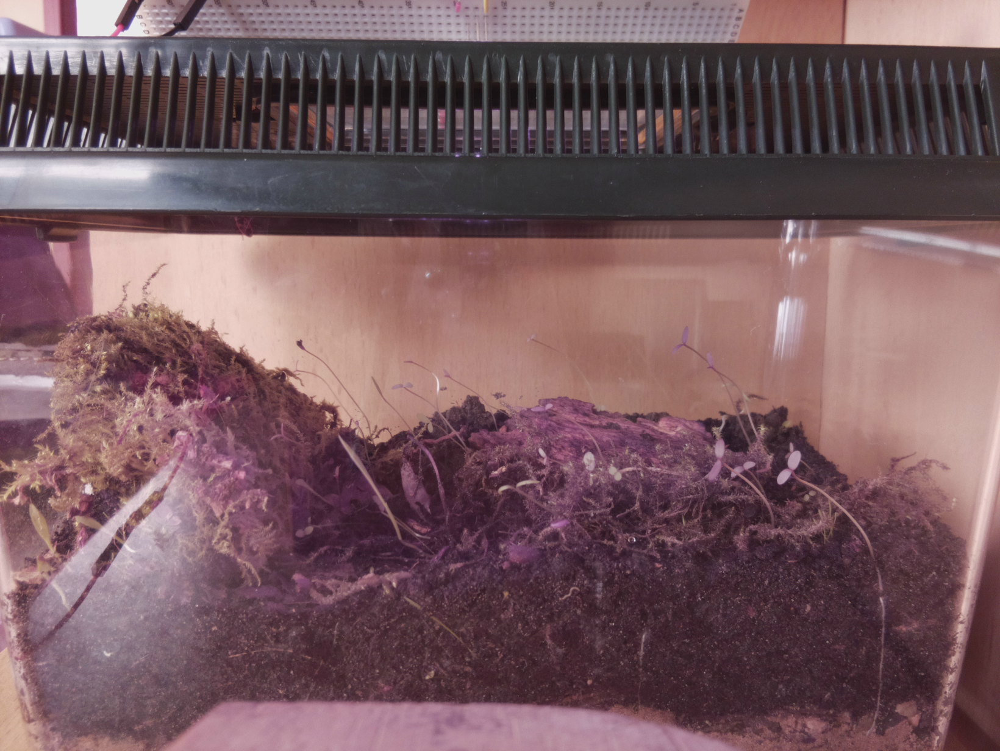
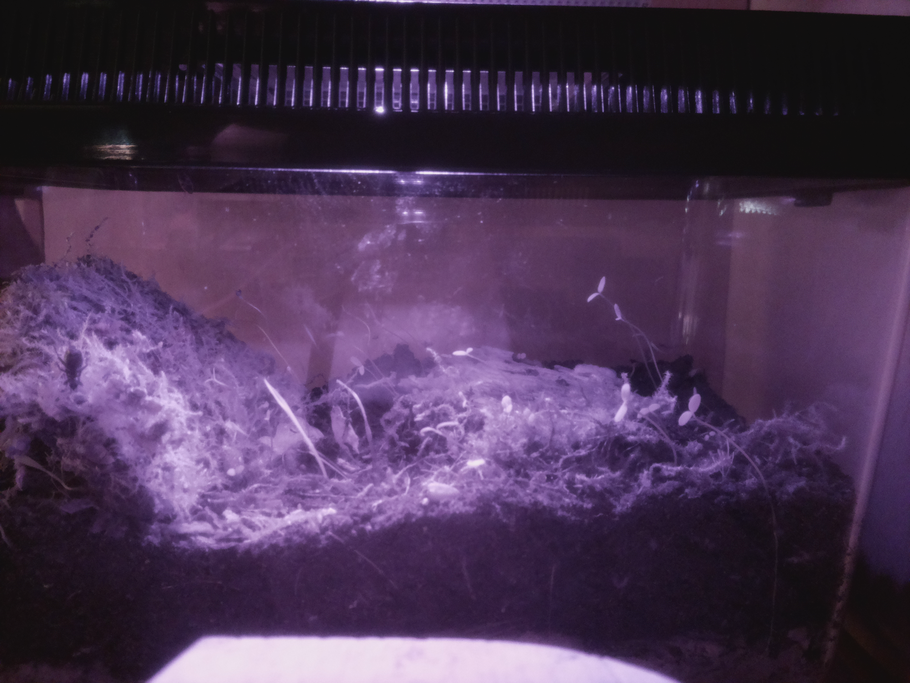

# Plantstalk

Some scripts to use the raspberrypi camera for shooting images of basically anything, (e.g. a terrarium).

## Example images:






## convert pictures to video like this:
```
cat *.png | ffmpeg -f image2pipe -i - 2017-04-13.mkv
```

